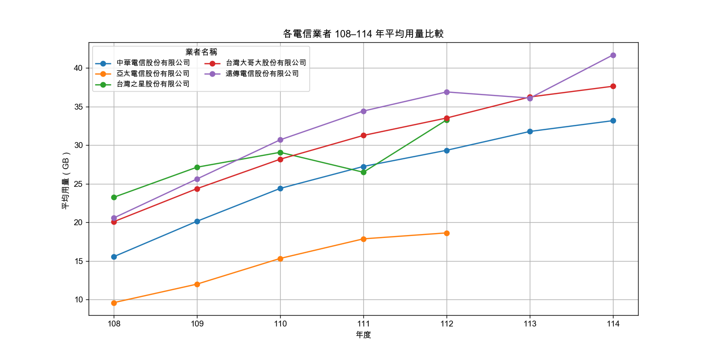
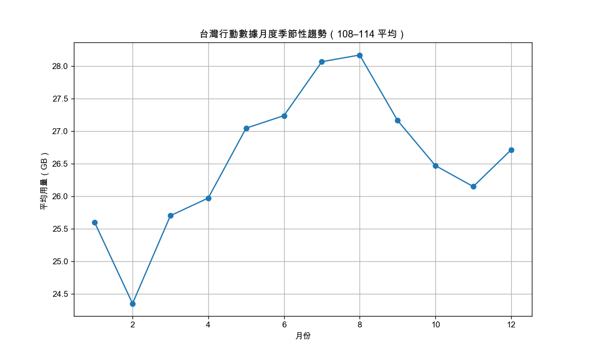

#  台灣行動寬頻用量趨勢視覺化工具  

本專案使用 Python 讀取政府開放資料的「行動寬頻用戶平均數據用量」，  
並在清理與整理資料後，產生三張趨勢圖，用來觀察不同年度、不同電信業者與月份之間的用量變化。

此專案為 Python 自動化報表後延伸製作的視覺化， 
利用已分類整理後的年份建立「資料讀取 → 整理 → 分析 → 視覺化」的完整流程。

---
### 經由自動化報表整理好的年份

---

### 年度平均用量趨勢  

### 各業者用量比較  

### 月份季節性趨勢  

---

##  專案亮點  

- 數據清理（拆欄位、過濾條件）  
- 分組統計（groupby）  
- 基本資料視覺化（matplotlib）  
- 中文顯示問題排除（字體設定）  
- 建立分析流程並輸出清楚的圖表  

此專案與「Python 自動化報表工具」相互補充，  
展示在資料處理與程式應用方面的學習成果。

---

## 未來可延伸

- 用Power BI或Tableau增加互動Dashboard  
- 增加預測模型工具(future work)   

