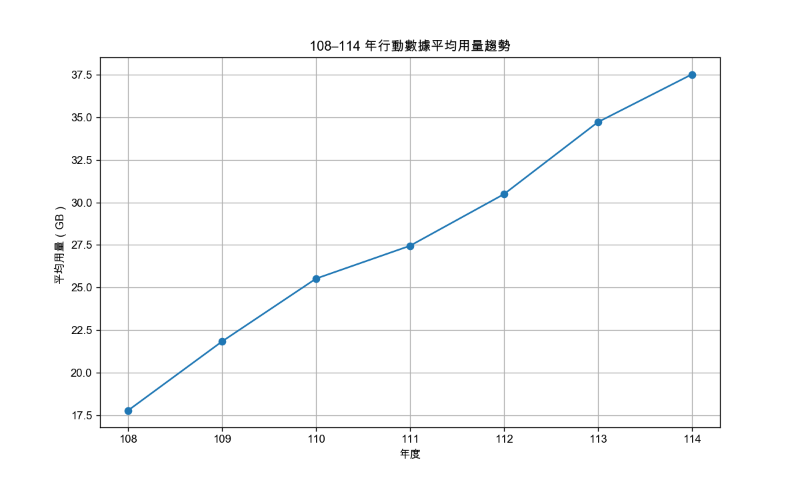

#  台灣行動寬頻用量趨勢視覺化工具  

本專案使用 Python 讀取政府開放資料的「行動寬頻用戶平均數據用量」，  
並在清理與整理資料後，產生三張趨勢圖，用來觀察不同年度、不同電信業者與月份之間的用量變化。

此專案為在 Python 自動化報表後延伸製作的視覺化練習，  
目的是建立「資料讀取 → 整理 → 分析 → 視覺化」的完整流程。

---

## 📂 專案內容

### ■ 使用技術
- Python 3  
- pandas  
- matplotlib  
- macOS 字體設定（解決中文無法顯示問題）

---

## 🛠️ 主要功能
1. 讀取 CSV 原始資料  
2. 去除欄位空白並拆分年月  
3. 過濾 108～114 年資料  
4. 產生三種視覺化圖表並自動輸出到 `charts/` 資料夾  

---

## ▶ 使用方式

### 1️⃣ 安裝必要套件
```
pip install -r requirements.txt
```

requirements.txt 內容：
```
pandas
matplotlib
```

### 3. 圖片輸出位置  
執行後會在 `charts/` 資料夾自動生成：

- yearly_trend.png  
- operator_comparison.png  
- seasonality.png  

---

# 📊 視覺化成果

### ■ 年度平均用量趨勢  


### ■ 各業者用量比較  


### ■ 月份季節性趨勢  


---

## 📁 專案結構
```
├── input_data/                  
│   └── 行動寬頻用戶每月平均數據用量.csv
│
├── charts/
│   ├── yearly_trend.png
│   ├── operator_comparison.png
│   └── seasonality.png
│
└── visualize.py
```

---

## 💡 專案亮點  

- 數據清理（拆欄位、過濾條件）  
- 分組統計（groupby）  
- 基本資料視覺化（matplotlib）  
- 中文顯示問題排除（字體設定）  
- 建立分析流程並輸出清楚的圖表  

此專案與「Python 自動化報表工具」相互補充，  
展示我在資料處理與程式應用方面的學習成果。

---

## 未來可延伸

- 用Power BI或Tableau增加互動Dashboard  
- 增加預測模型工具(future work)   

## 🙋‍♂️ 作者

陳柏瀚 Jim Chen 
GitHub: https://github.com/sis051087
